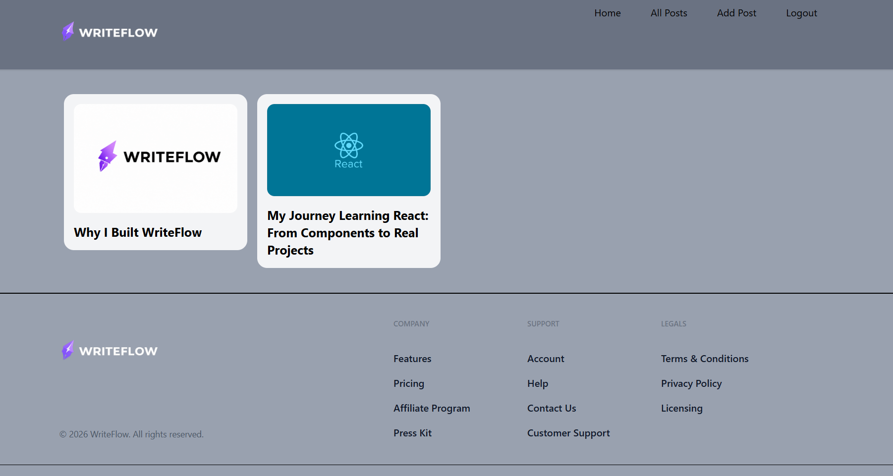
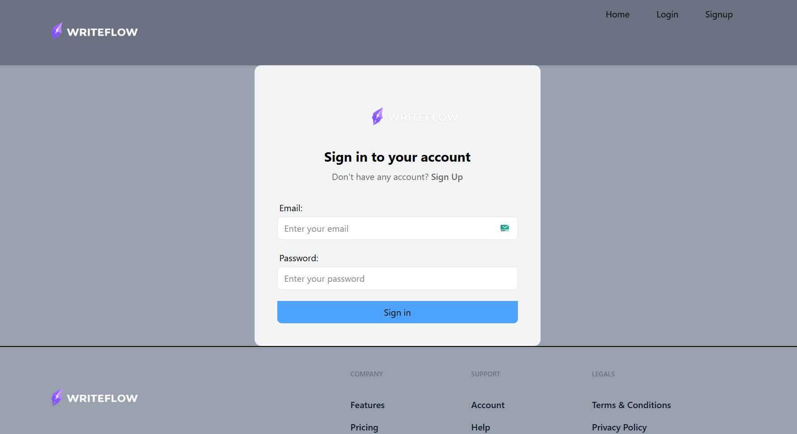
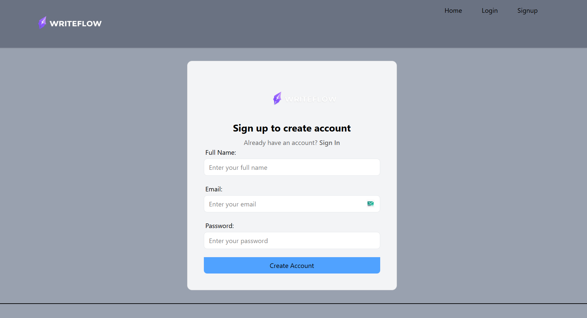
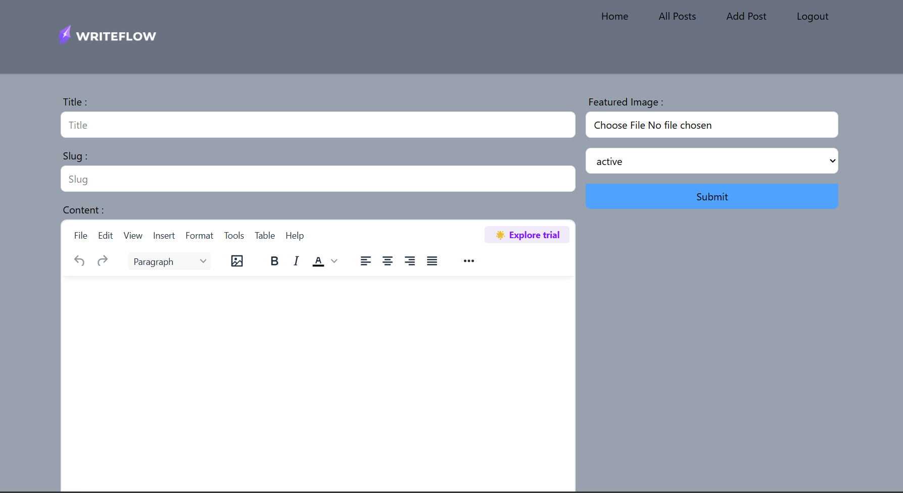
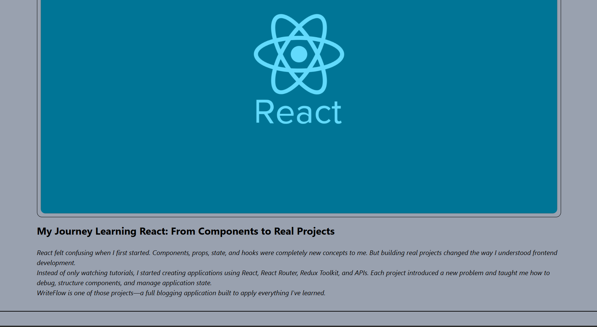

# ⚡ WriteFlow

WriteFlow is a modern blogging web application built with React and Appwrite. It allows users to create accounts, log in, publish blog posts, upload featured images, edit content using a rich text editor, and manage their posts.

## ✨ Features

- User authentication
- Sign up and login
- Create blog posts
- Edit existing posts
- Delete posts
- Upload featured images
- Rich text editor
- Active and inactive post status
- Dynamic slug generation
- Protected authenticated features
- Responsive user interface

## 🛠️ Tech Stack

- React.js
- Vite
- JavaScript
- Tailwind CSS
- Redux Toolkit
- React Router
- React Hook Form
- Appwrite
- TinyMCE

## ☁️ Backend Services

WriteFlow uses Appwrite for backend services:

- **Authentication** — User accounts and sessions
- **Database** — Blog post storage and management
- **Storage** — Featured image uploads and file management

## 📁 Project Structure

```text
src/
├── appwrite/
│   ├── auth.js
│   ├── config.js
│   └── storage.js
│
├── assets/
│
├── components/
│
├── conf/
│
├── pages/
│
├── store/
│
├── App.jsx
└── main.jsx
```

## 📸 Screenshots

### Home Page



### Login Page



### Signup Page



### Create Post



### Post Page




## 🔐 Environment Variables

Create a `.env` file in the root directory and add the following configuration:

```env
VITE_APPWRITE_URL=your_appwrite_endpoint
VITE_APPWRITE_PROJECT_ID=your_project_id
VITE_APPWRITE_DATABASE_ID=your_database_id
VITE_APPWRITE_TABLE_ID=your_table_id
VITE_APPWRITE_BUCKET_ID=your_bucket_id
VITE_TINYMCE_API_KEY=your_tinymce_api_key
```

Make sure the `.env` file is added to `.gitignore`.

```gitignore
.env
.env.local
```

## 🚀 Installation

Clone the repository:

```bash
git clone <your-repository-url>
```

Navigate to the project directory:

```bash
cd WriteFlow
```

Install dependencies:

```bash
npm install
```

Start the development server:

```bash
npm run dev
```

## 🔮 Future Improvements

- Search functionality
- Post categories and tags
- User profile pages
- Comments
- Likes and bookmarks
- Improved responsive design
- Dark mode

## 👨‍💻 Author

**Ashish Mutkule**

GitHub: https://github.com/Ashmk04

## 📄 Copyright

© 2026 WriteFlow. All rights reserved.